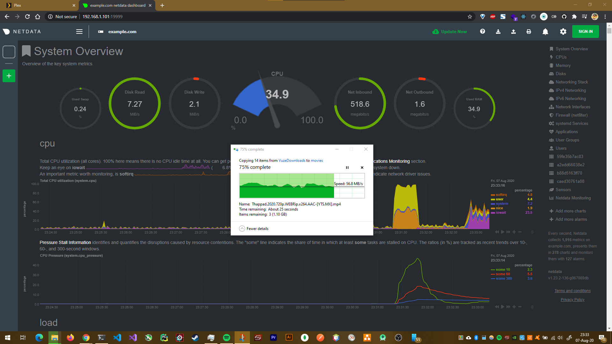

<div align="center">
    
    <h4 align="center">Projekt Astatine</h4>
</div>


---

My Personal Home-Media-Coding-Web Server or HMCW Server or Astatine Server

- [x] Samba Server
- [x] Plex Media Server
- [x] Netdata Server Monitoring
- [x] Theia Coding Server (mangd. by Rancher)
- [x] Rancher Docker Management

## Services

| service                   | ports        |
| ------------------------- | ------------ |
| Plex Media Server         | - web: 32400 |
| Rancher Docker Management | - web: 8080  |
| Samba - File Sharing      | - smb: 445   |
| Netdata - Server Monitor  | - web: 19999 |

## Instructions

- Samba Server
  - edit smb.conf and add all the folders and shares you want to create
  - make sure to add `:z` in `at-samba` so that docker manages the permissions correctly
- Plex Media Server
  - get your claim token from https://www.plex.tv/claim/ and add it in `PLEX.env` environment file
- Rancher
  - when adding the rancher host, and running the command on server add this environment variable `sudo docker run -e CATTLE_AGENT_IP=192.168.1.101` i.e. `CATTLE_AGENT` as the local ip

## Running

Build the image

```shell
$ docker-compose build
```

Start the Container
```shell
$ docker-compose up -d
```

Shutdown the Swarm
```shell
$ docker-compose down
```

Shutdown and remove persistent volumes created by docker
```shell
$ docker-compose down -v
```

## Screenshots

SSH


File Transfer using Samba and NetData for stats


Rancher for managing Theia Web IDE


Plex Media Server

